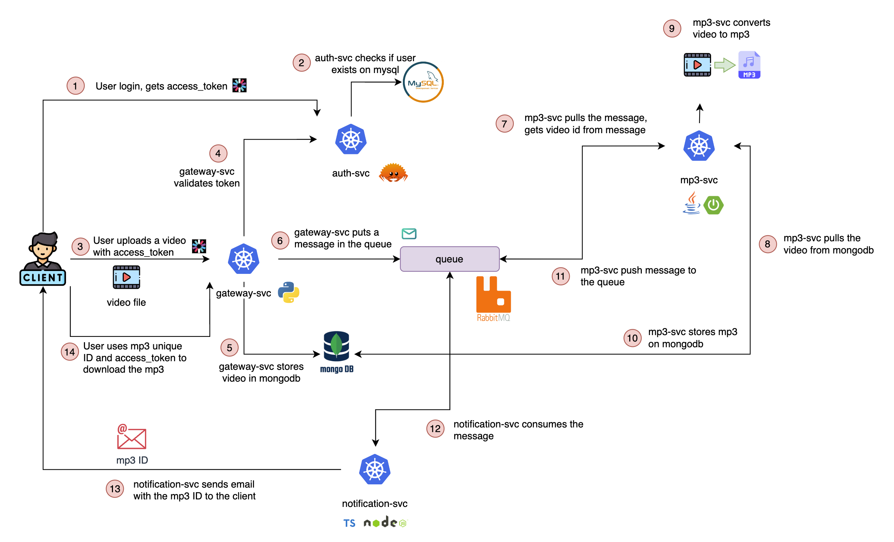

# Architecture

The architecture is implemented using the following technologies `kubernetes`, `mysql`, `mongodb`, `actix-web`, `jwt`, `python`, `node`, `rabbitmq`




| Service            | Language |
|--------------------|----------|
| auth-svc           | Rust     |
| gateway-svc        | Python   |
| mp3-svc            | Java     |
| notification-svc   | Node     |


## Develop (docker-compose)

1. Create `.env` at the root of the project

```sh
AUTH_SVC_NAME=auth-svc
DB_SVC_NAME=db
MONGO_SVC_NAME=mongo


########### auth-scv
# mysql
MYSQL_ROOT_PASSWORD=****
MYSQL_DATABASE=auth
MYSQL_USER=****
MYSQL_PASSWORD=****

MYSQL_TEST_USERNAME=****
MYSQL_TEST_PASSWORD=****

# app
DB_PORT=3306
DB_HOST=${DB_SVC_NAME}
APP_PORT=5004
DATABASE_URL=mysql://${MYSQL_USER}:${MYSQL_PASSWORD}@${DB_HOST}:${DB_PORT}/${MYSQL_DATABASE}
JWT_SECRET=****


########### gateway-scv
AUTH_SVC_ADDRESS=${AUTH_SVC_NAME}:${APP_PORT}
MONGO_URI=mongodb://${MONGO_SVC_NAME}:27017/videos

MONGO_INITDB_ROOT_USERNAME=root
MONGO_INITDB_ROOT_PASSWORD=example

########### rabbitmq
```


2. Run `docker-compose` command

```sh
docker-compose up -d
```
